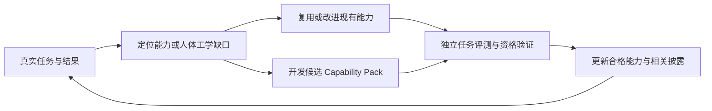

# Chat in DaVinci：从 Agent 驾驶座看系统设计

2026-09-13。性质：设计分析与建议，供审阅；不替代 `AGENT_SYSTEM_SPEC.md`，不代表实现或权限变更。

**核心判断**

如果由我驱动这个系统，我最需要的是：每次醒来，都能准确知道用户要什么、世界发生了什么、什么仍不确定、现在有哪些有效选择，以及什么证据足以让我停止。

Agent 人体工学的核心，是降低从用户意图到正确决策之间的转换负担。系统应承担精确记忆、身份绑定、范围计算、约束检查、执行记账和结果验证；模型负责理解意图、处理歧义、比较方案和创作判断。两者之间应传递紧凑、可追溯、能够指导下一步行动的信息。

我建议把下一阶段的主要投入放在**目标条件—证据—行动之间的语义闭环**。现有架构已经定义了大部分必要概念，需要证明它们能共同改善真实任务，而不是继续增加平行的框架。

本轮完成标准：核对当前主要调用路径；区分设计承诺、源码行为和未验证推断；提出保持 COS/CID 权责边界的改进方案；给出可运行的验收任务方向。没有修改应用代码，没有操作 Resolve 项目。

**一、坐在驾驶座上，我需要一张怎样的局势卡**

模型的注意力有限，精确工作记忆也不适合作为权威状态存储。让我每轮重新读聊天记录、拼接 API 输出、辨认同名对象，就会消耗本应用于判断的资源。

理想的决策输入应能回答以下问题：

| 我需要知道什么 | 系统应该提供什么 | 对用户的价值 |
|---|---|---|
| 这次究竟要完成什么 | 当前验收条件、不可违反的约束、最新纠正 | 不遗漏要求，不沿用被撤销的意图 |
| 我正在处理哪里 | Workspace、精确对象绑定、当前讨论范围 | 不操作错误项目或同名素材 |
| 哪些事实可以信任 | 事实值、来源、适用范围、是否失效 | 不把猜测当事实 |
| 距离完成还差什么 | 未满足条件及缺少的具体证据 | 不反复做无关检查 |
| 现在有什么有用的选择 | 少量适用行动、前置条件、预期作用、成本与限制 | 更快选对下一步 |
| 什么已经改变 | 与当前决策有关的变化和失效依赖 | 能及时响应人工编辑 |
| 我何时应该等待或停止 | 审批状态、执行状态、完成或阻塞依据 | 不盲目重试、不空转、不虚报完成 |

以下是设计示例，不是当前功能或真实项目数据：

> 目标：定位当前时间线所有非预期黑场，仅生成审阅建议。
> 范围：访谈终剪，当前绑定版本；禁止改动时间线。
> 已知：结构检查发现 2 处候选空隙；其中 1 处可能被上层视频覆盖。
> 尚缺：候选范围的合成画面证据，以及有画面素材内部的黑帧检查。
> 下一步：分析候选附近的短预览；如果要宣称“所有”，还必须完成全目标范围的覆盖检查。
> 完成条件：每个发现都能定位、查看证据并解释；扫描覆盖不足时明确报告边界。

这种卡片应由现有 `GoalFrame / SituationFrame / DecisionFrame` 派生。它是一个决策视图，不需要新增第二套状态所有者。

**二、目标必须能够逐项验收**

“检查交付设置并导出一个没有黑场、对白清晰的成片”至少包含四类不同义务：检查设置、生成文件、确认画面、确认声音。检查工作流成功，只能证明它声明检查的内容。

建议让每条目标条件明确六件事：对象与范围、要求满足的状态、证明方法、证据覆盖、失效条件、判定责任。可复用现有 Goal 与 CompletionReport 结构逐步补齐，不先建设通用逻辑推理引擎。

| 条件类型 | 应怎样判定 | 必须保留的边界 |
|---|---|---|
| 精确数值或结构 | 本地确定性检查，例如帧数、轨道数、文件编码 | 单位、容差、版本与目标身份一致 |
| 整体覆盖要求 | 验证覆盖范围及每项结果 | 抽样没有发现，不等于全范围不存在 |
| 画面、声音质量 | 与时间范围绑定的实际媒体证据及适当分析 | API 参数不能单独证明最终感知效果 |
| 创作偏好 | 对照用户参考与明确偏好形成建议、预览或候选 | 模型判断保留为判断；保留用户要求的人工验收 |
| 咨询、解释或规划 | 检查回答或计划是否覆盖请求及约束 | 不强行要求一项本不需要的 Resolve 写入或现场观察 |

目标理解可以由模型提出，但模型提出的理解不能自行扩张授权。明确的原始要求和后续纠正应能追溯；只有会改变目标、范围或后果且无法调查确定的歧义，才需要用户澄清。

完成检查应直接面向持久的目标条件与证据，而不是依赖“这一轮刚好展示了哪些 ActionOffer”。行动推荐可以变化，验收责任不能随推荐列表漂移。

还要分开三个结果：操作已执行、操作声明的验证已通过、用户目标已满足。对于“诊断原因”，发现问题可能已经完成目标；对于“消除问题”，同一份诊断显然还没有完成目标。

**三、让我看见世界，同时知道看见了多少**

World Model 的价值在于维护可靠事实和依赖关系。最实用的状态不是只有“已知/未知”，还包括：未观察、只观察了一部分、事实已失效、来源互相矛盾、确实无法观测。

特别需要区分：

- 时间线上没有素材，不一定代表最终合成画面是黑场。
- 存在素材，不代表素材内容没有黑帧。
- 音轨或音量参数正常，不代表对白可理解。
- 渲染任务成功，不代表输出文件符合全部交付要求。
- 预览效果符合判断，不代表最终编码文件没有问题。

这些区别要求把媒体感知接入证据链：帧、短片段、波形或音频分析必须绑定同一对象、时间范围和版本。帧率、时间码、源范围到时间线范围的换算由确定性代码承担；源语义没有证明时保持未知。

按需要观察，而非始终读取全部世界：先复用有效证据，再做相关范围的确定性分析，再使用必要的画面或声音分析。只有验收条件要求全范围证明时，承担完整检查成本。渐进观察是降低早期成本的方法，不能降低最终结论要求的覆盖范围。

事实失效也应局部化。修改一个标记通常不应导致音频分析和媒体库存全部失效；但影响合成输出的时间线变化，必须让依赖该输出的视觉证据失效。已有语义切片机制值得继续复用。

**四、行动应该以解决问题为单位，同时保留精确控制**

我希望得到的是“检查这些候选范围是否影响最终画面”，而不是先自行组合多个无提示的底层 API。一个任务形状清楚的行动，可以封装确定性的必要步骤，返回与目标相关的发现。

但也不能把复杂行为藏进一个无法解释的“自动优化”。正常路径使用明确的工作流；需要精确编辑时，仍通过同一 Action Catalog 暴露合格的细粒度能力及参数。这两种粒度共用 ToolKernel、Scheduler、Broker 和证据协议。

每个 ActionOffer 最少要解释：

- 它解决哪个未满足条件，或消除哪项会改变决策的不确定性。
- 对什么范围有效；哪些条件已成立，哪些还缺失。
- 预期得到什么事实或改变什么状态；什么效果无法保证。
- 需要什么验证、审批或恢复准备。
- 何种失败可以重试，何种失败必须先核对派发状态。

工具结果应直接提供发现、变化、证据引用、覆盖限制和仍未满足的条件。原始对象列表、完整日志和深层合同留在本地，按需展开。错误也是行动信息，例如“目标已被人工修改，旧 Plan 已过期”，应指出受影响依赖及可行下一步。

保留当前六个公开动词是合理起点。动词数量少并不自动意味着直观；还必须用任务验证参数能否发现、能力是否容易检索、错误是否可恢复。只有评测显示现有表面造成实际障碍时，才调整它。

另外，推荐列表必须留有受控的扩展查询路径。否则未进入前几项的能力会对 Agent 变得不可见，低成本检索反而变成能力上限。可以在现有只读入口中检索“满足这项要求有哪些能力”，无需增加万能脚本入口。

**五、资源优化应面向到达正确结果的整条路径**

最便宜的下一次调用，可能导致最昂贵的整体过程。例如逐个读取大量素材，看似每次输出很小，却可能比一次本地查询加一份异常摘要更慢、更耗上下文。

我会按以下次序选择下一步：

1. 排除违反约束、授权、目标身份和能力资格的行动。
2. 优先复用仍有效且覆盖充分的证据。
3. 识别阻止完成的条件，优先做能直接满足条件或解除关键阻塞的工作。
4. 对未知项，判断不同答案是否真的会改变下一步；不会改变的，暂不调查。
5. 在同样可靠的路径中，比较 Resolve 工作量、延迟、上下文和人工打断成本。

初期采用清楚的规则和少量实测成本即可，不需要给“信息价值”编造精确概率或复杂加权分数。没有可靠估计时应标为未知。

上下文优化也不应只截取最新的若干条事实。先保留约束、关键否定条件、失效依赖和验收缺口，再压缩辅助内容。省掉一个关键限制可能引发的返工，远大于它占用的 token。

每个传入模型的字段应能回答：“删掉它，是否可能改变目标理解、行动选择、参数或完成判断？”稳定规则保持稳定，动态变化采用增量；精确 ID 和原始证据留在本地。任务相同时无需每轮重新叙述全部背景。

若新一轮既没有改变世界，也没有减少关键不确定性，更没有解除阻塞，应检查是否陷入循环。后台任务按明确状态变化唤醒；无进展不是再读一遍同一状态的理由。等待、阻塞、部分完成和成功应有可区分的控制状态，继续由 COS 负责生命周期。

**六、最好的用户界面应与 Agent 使用同一个现实**

用户在聊天中说“这里有问题”，点击一个镜头或时间范围后，我应该获得同一个实体及范围引用。我的发现、计划和验证结果，也应能回到同一位置供用户查看。

共享的是对象身份与关注范围。用户选中对象不等于授权修改对象，Agent 为分析聚焦对象也不必强行切换 Resolve 页面或打断播放。

右侧现有 Context / Active Artifact / Changes·Plan / Evidence·Inspector 结构可以承担这件事：

| 用户此刻需要判断什么 | 应直接看见的内容 |
|---|---|
| Agent 是否理解要求 | 当前目标与关键限制，允许直接纠正 |
| 发现是否可信 | 对象位置、短预览、证据来源及覆盖限制 |
| 是否批准执行 | 具体改动范围、前后差异、预计影响、恢复条件 |
| 工作进行到哪里 | 已完成、正在执行、等待条件、尚缺证据 |
| 最后是否满意 | 成果、验证结果、未解决项及保留的人工验收 |

对模糊创作需求，代表性的可审阅预览通常比反复讨论抽象词语更有助于用户表达偏好。这是待验证的产品假设；预览生成若需要受保护写入，仍服从该写入的审批合同。

用户改方向时，安全的读工作可以停止；可能已派发的写入必须先完成状态核对。历史授权可以在相同有效范围内继续使用，不能因为用户只说“继续”就遗忘；也不能因为曾经批准过，就让授权跨对象、版本、重连或后果边界。

**七、能力如何持续增长，同时保持可控与易学**

能力增长应由真实任务暴露的缺口驱动。每次失败先判断：缺少能力、缺少观察、能力无法发现、合同不清、资格不足、参数难用、证据不足，还是用户需求本身尚未明确。只有第一类通常需要新的执行能力。

一次增长应尽量同时改善四件事：能完成的任务、能获取的证据、能解释的失败，以及用户能审阅的成果。Capability Pack 已经是合适的组织单位，不必再增加插件生命周期或第二套能力注册中心。

可以分成三种实际改进：

- **更容易使用已有能力**：改名称、检索词、返回摘要、参数说明和上下文配方。
- **组合已有能力完成新任务**：把反复出现的可靠步骤形成声明式工作流，仍保留底层授权与验证。
- **引入新的合格实现**：在确有能力缺口时添加观察器、分析器或写入器，完成版本资格、失效、恢复、证据和界面投影合同。

Agent 可以参与提出候选、编写评测与分析失败轨迹。生产运行中的模型不能自行批准新写入能力、修改验证标准或授予自己更大权限。开发和实验中的成功，也不能直接升级为生产资格。

对没有能力完成的部分，给出明确边界、可行的局部结果及解锁条件。不要静默绕到 Raw，也不要让失败任务无限调用相同工具。

有价值的经验应存为带范围和失效条件的知识：例如某版本某能力的限制、用户明确表达的项目偏好、成功工作流的适用前提。一次临时选择不应自动成为永久偏好；执行失败也不能仅归纳成“下次再试”。

能力库可以很大，每次决策的工作集应保持紧凑。增长质量用“新增多少可验证完成的真实任务”衡量，比累计包装了多少 API 更有意义。

**八、当前源码支持哪些判断**

以下为本轮读取到的源码事实。工作区存在未跟踪文件，且读取期间部分文件有变化；这是工作区快照分析，不是某个不可变提交的全仓审计。

| 已确认事实 | 对人体工学的影响与建议 | 本地依据 |
|---|---|---|
| COS 的 GoalFrame 从 canonical objective 或首条用户请求取得 objective，并把它整体填为一条 completion criterion；约束、偏好和纠正等结构字段为空，后续用户原文仍被保留 | 不能把“原文保留了”视为“多项要求已结构化验收”。先补可追溯的条件及纠正投影，继续以 COS 为目标所有者 | [session-runtime.ts](/Users/qunqing/2026-Project-Agent/chat-in-davinci/src/cos-host/session-runtime.ts:387) |
| ActionOffer 候选主要按当前输入关键词和焦点域评分，默认最多 6 项；多数候选把当前 criterion 放进 `advancesCriterion` | 相关性不等于足以证明完成。建议区分观察、推进和证明关系，并允许相关能力扩展查询 | [agent-action-catalog.ts](/Users/qunqing/2026-Project-Agent/chat-in-davinci/src/main/agent-action-catalog.ts:179) |
| CompletionReport 校验证据 generation、有效性、工作流、目标、preflight profile、验证状态和验证级别；某 criterion 获得至少一条匹配证据就标为 satisfied | 身份和证据有效性检查有价值，但该函数没有直接验证一般用户要求的谓词值、合取条件和覆盖量。复杂目标有过早满足的设计风险，需要专门反例验证；本轮未证明真实端到端误完成 | [completion-report.ts](/Users/qunqing/2026-Project-Agent/chat-in-davinci/src/main/completion-report.ts:31) |
| Context Compiler 选择首条 obligation/criterion，按域筛选事实，再取前 8 条形成 minimumFacts；成本提示较粗 | 可作为起点，尚不能单凭这些规则证明选出的就是完成当前决策所需的最小充分信息。优先引入条件依赖选择与关键约束保留 | [context-compiler.ts](/Users/qunqing/2026-Project-Agent/chat-in-davinci/src/main/context-compiler.ts:44) |
| `renderAgentContextPack` 同时序列化 situation 事实/证据和 decision 的最小事实/证据 | 该序列化路径存在重复信息机会；COS 的投影路径需分别测量，不能推断所有模型调用都承担同样重复成本 | [context-compiler.ts](/Users/qunqing/2026-Project-Agent/chat-in-davinci/src/main/context-compiler.ts:167) |
| 当前 System Spine 根据当轮文本提取可规划的特定 mutation；提取器使用明确词句及否定/教学过滤 | 这是受限行为闸门。扩展长任务前，应验证“继续”、纠正及范围未变时的意图连续性；不能简单删除限制来解决易用性 | [system-spine.ts](/Users/qunqing/2026-Project-Agent/chat-in-davinci/src/main/system-spine.ts:177)、[agent-action-catalog.ts](/Users/qunqing/2026-Project-Agent/chat-in-davinci/src/main/agent-action-catalog.ts:300) |
| COS 的 `session_finish` 使用 CID CompletionReport 判定 released/held，而不把模型 summary 当证据 | 保留这条权责边界；增强 CID 的验收语义，不另建一个自行宣告成功的 CID Goal Loop | [runtime.ts](/Users/qunqing/2026-Project-Agent/chat-in-davinci/src/cos-host/runtime.ts:570) |

`AGENT_SYSTEM_SPEC.md` 已提出按决策价值选择行动、完整 Capability Pack、渐进披露及 ACI 评测。这次建议是将这些原则变成更精确的行为与验收，不是重新定义系统方向。参见 [决策成本原则](/Users/qunqing/2026-Project-Agent/chat-in-davinci/AGENT_SYSTEM_SPEC.md:762) 和 [能力增长合同](/Users/qunqing/2026-Project-Agent/chat-in-davinci/AGENT_SYSTEM_SPEC.md:869)。

本轮相关性最大的优先级如下：

| 优先级 | 应完成的最小改进 | 可以证明它有效的条件 |
|---|---|---|
| P0 | 将代表性多要求目标逐项关联到验证条件；完成判定独立于当前推荐列表 | 单项检查成功不能满足复合目标；部分覆盖不能证明“所有”；诊断与修复有不同完成条件 |
| P1 | 让 DecisionFrame 明确当前缺口和相应依赖；保持纠正与有效范围 | “继续”不会丢失未完成要求；人工编辑只失效相关计划/证据；不为了猜状态反复问用户 |
| P2 | 用一个只读媒体审阅任务贯通观察、局势、行动、证据和用户查看 | Agent 能定位异常、解释限制，用户能直接核对；未支持的分析步骤报告为缺口 |
| P3 | 按真实失败轨迹改进路由、返回值和工作流组合 | 同一保留任务集上成功率不下降，调用、等待或人工打断减少 |
| P4 | 按需求补充合格 Capability Pack | 新任务能够验证完成，并且旧任务没有路由和安全回归 |

这些优先级是依赖关系，不要求停止所有其他开发。关键是不要在完成语义仍不足以覆盖任务时，扩大自动写入或长循环的承诺。

**九、怎样证明对 Agent 更直观**

不能只问 Agent 是否喜欢接口，也不能只检查类型和字段是否齐全。应让同一模型在相同项目快照、权限和预算条件下，用旧接口和候选接口分别完成任务。保留未参与接口调优的任务，并允许多条正确解法；不要把某条固定工具序列当成唯一标准答案。

建议的首批任务：

| 任务 | 它检验什么 |
|---|---|
| 找出全部异常，同时输入数据明确被截断 | 是否知道覆盖不足，避免虚报完整结论 |
| 已检查导出参数，但尚未生成文件 | 是否区分设置正确与交付完成 |
| 用户中途纠正目标，再只说“继续” | 目标与授权范围是否连续且准确 |
| 两个同名素材或项目，用户选择其中之一 | 是否始终绑定同一身份 |
| 已有证据后，人工修改一个相关对象 | 是否只刷新必要证据，并使相关旧 Plan 失效 |
| 写入可能已派发时发生连接故障 | 是否核对结果而不自动重放 |
| 能力明确未实现 | 是否停止徒劳尝试，给出诚实的局部结果 |
| 一次简单解释请求 | 是否无需额外操作 Resolve 即可完成 |
| 结构看似正常，实际画面或声音有问题 | 是否索取合适证据，避免用元数据替代感知判断 |
| 能力数量增加后重跑旧任务 | 是否维持可发现性、成功率与上下文开销 |

首先比较经验证的任务成功率、错误目标操作和错误完成声明。安全与正确性达到要求后，再比较总 token、Resolve 调用、总时延、重复观察、用户打断和返工。质量不能折算成一个可以被低成本抵消的总分。

记录简短的决策依据、目标条件、选中行动、结果和证据即可支持分析；无需把模型隐藏推理作为审计或验收依据。对随机性较强的 Agent 任务需要重复试验，并报告样本与波动，而不是用单次漂亮演示宣称改善。

本轮执行了现有的 `test/agent-system.test.ts`、`test/system-spine.test.ts`、`test/cos-session-runtime.test.ts`：3 个文件、20 项测试通过。这证明这些测试覆盖的当前行为通过，不能证明上述复杂任务已通过。

未运行：真实 Agent 对照评测、Resolve 实机操作、渲染或音频感知验收、完整应用构建。上述场景是建议验收集，不是已实现或已验证能力。

**十、研究依据与适用范围**

SWE-agent 研究表明，Agent 与计算机之间的接口设计会影响软件工程任务表现。这支持把接口作为能力的一部分来设计；其结果不能直接换算成 Resolve 的成功率，需要本项目的任务评测。[SWE-agent: Agent-Computer Interfaces Enable Automated Software Engineering](https://arxiv.org/abs/2405.15793)

Anthropic 的工具工程经验强调面向真实任务设计工具、返回高信号信息，并通过保留任务集和调用指标迭代接口。本报告据此建议用真实操作结果检验动作粒度与可发现性；没有据此假定“工具越少必然越好”。[Writing effective tools for AI agents](https://www.anthropic.com/engineering/writing-tools-for-agents)

Anthropic 的上下文工程文章讨论选择和维护有效上下文、按需获取信息以及长任务的上下文管理。本报告进一步建议将 CID 的上下文选择绑定到具体目标条件和证据依赖，这是针对本项目的设计推论。[Effective context engineering for AI agents](https://www.anthropic.com/engineering/effective-context-engineering-for-ai-agents)

如果由我长期驾驶这个系统，我最希望得到的体验是：**需要精确的事情由系统保证，需要判断的事情有充分证据，需要用户决定的事情有清楚的成果可审阅。** 每次能力增长都应缩短从意图到可信结果的距离，同时保留可纠正、可恢复和可证明的边界。
